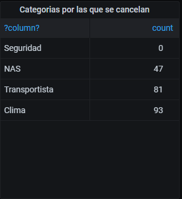

# Indicaciones

> Todas las peticiones son tipo GET consumidas como REST API, las peticiones tendran la extension definida en cada consulta (ejemplo: url/consulta1, donde url sera el dominio donde se ubique el servidor ejemplo 'localhost'). 

**1.** Num Retraso de llegada por ruta

** Tiene N objetos
> Peticion GET a la direccion 'url/consulta1'

Formato JSON que se espera del backend:
https://gist.github.com/FreddieAbad/16db0c2acf29b03f06bceb7023c50af0

Consultas: 
~~~~sql
select origin, dest, count(arrdelay) as "Conteo Restraso de llegada" 
from aeropuerto
where arrdelay != 'NA' 
group by origin, dest
order by count(arrdelay) desc
~~~~

**2.** Num Retraso de salida por ruta

** Tiene N objetos

> Peticion GET a la direccion 'url/consulta2'

Formato JSON que se espera del backend:
https://gist.github.com/FreddieAbad/ca1df37102b759bff642ac345c6cef21

Consultas: 
~~~~sql
select origin, dest, count(depdelay) as "Conteo Restraso de llegada" 
from aeropuerto
where depdelay != 'NA' 
group by origin, dest
order by count(depdelay) desc
~~~~

**3.** Total Retrasos por salida de ruta en especifico

** Solo tiene 2 objetos

** Recibe la variable $var_dest y $var_origin, que serviran para definir los parametros del where

> Peticion GET a la direccion 'url/consulta3/origin=$var_origin/dest=$var_dest'

> Parametros 
Formato JSON que se espera del backend:
https://gist.github.com/FreddieAbad/974bddf83fca9ae1e4548fe5c44c15ae

Consultas: 
~~~~sql
--Salida
select count(arrdelay) as "Conteo Restraso de llegada" from aeropuerto
where arrdelay != 'NA' and origin='SFO' and dest='PDX';
--Llegada
select count(arrdelay) as "Conteo Restraso de llegada" from aeropuerto
where arrdelay != 'NA' and origin='SFO' and dest='PDX';
~~~~

**4.** Num retrasos por salida por aerolinea

** Tiene N objetos

> Peticion GET a la direccion 'url/consulta4'

Formato JSON que se espera del backend:
https://gist.github.com/FreddieAbad/12b2c49505545ed230e114d7954afc47

Consultas: 
~~~~sql
select uniquecarrier as "Aerolinea", count(depdelay) as "Conteo Restraso de llegada por Aerolinea" 
from aeropuerto
where depdelay != 'NA' 
group by uniquecarrier
order by uniquecarrier
~~~~

**5.** Num retrasos por llegada por aerolinea

** Tiene N objetos

> Peticion GET a la direccion 'url/consulta5'

Formato JSON que se espera del backend:
https://gist.github.com/FreddieAbad/3c4c7698ff881e637c8b7ca008446e3b

Consultas: 
~~~~sql
select uniquecarrier as "Aerolinea", count(arrdelay) as "Conteo Restraso de llegada por Aerolinea" 
from aeropuerto
where arrdelay != 'NA' 
group by uniquecarrier
order by uniquecarrier

~~~~

**6.** Aerolinea con mas retrasos de salida y llegada

** Solo tiene 2 objetos

> Peticion GET a la direccion 'url/consulta6'

Formato JSON que se espera del backend:
https://gist.github.com/FreddieAbad/6fa30d910a1e08f18b25e5f5458bcb73

Consultas: 
~~~~sql
select uniquecarrier as "Aerolinea", count(depdelay) as "Restraso de llegada de la Aerolinea" 
from aeropuerto
where depdelay != 'NA' 
group by uniquecarrier
order by count(depdelay) desc
limit 1
~~~~

**7.** Aerolinea con menos retrasos de salida y llegada

** Solo tiene 2 objetos

> Peticion GET a la direccion 'url/consulta7'

Formato JSON que se espera del backend:
https://gist.github.com/FreddieAbad/ffb051d074758407f1119b2aa8f8fdd4

Consultas: 
~~~~sql
select uniquecarrier as "Aerolinea", count(depdelay) as "Restraso de llegada de la Aerolinea" 
from aeropuerto
where depdelay != 'NA' 
group by uniquecarrier
order by count(depdelay) asc
limit 1
~~~~

**8.** Num retraso de salida por aerolinea y condicion climatica por ruta

** Tiene N objetos

> Peticion GET a la direccion 'url/consulta8'

Formato JSON que se espera del backend:
https://gist.github.com/FreddieAbad/fc91082d7918f4222d2285775b6d7740

Consultas: 
~~~~sql

select uniquecarrier as "Aerolinea", origin, dest, count(depdelay) as "Conteo Restraso de salida por Aerolinea por Ruta" 
from aeropuerto
where carrierdelay != 'NA' and weatherdelay != 'NA'
group by uniquecarrier, origin, dest, depdelay
ORDER BY count(depdelay) DESC
~~~~

**9.** Num retraso de LLEGADA por aerolinea y condicion climatica por ruta

** Tiene N objetos

> Peticion GET a la direccion 'url/consulta9'

Formato JSON que se espera del backend:
https://gist.github.com/FreddieAbad/0f7e94d8ad08086f9bc7ea9cf5c53ac2

Consultas: 
~~~~sql

select uniquecarrier as "Aerolinea", origin, dest, count(arrdelay) as "Conteo Restraso de llegada por Aerolinea por Ruta" 
from aeropuerto
where carrierdelay != 'NA'  and weatherdelay != 'NA'
group by uniquecarrier, origin, dest, arrdelay
ORDER BY count(arrdelay) DESC

~~~~

**10.** Historico de vuelos no cancelados

** Tiene N objetos

> Peticion GET a la direccion 'url/consulta10'

Formato JSON que se espera del backend:
https://gist.github.com/FreddieAbad/8b4b37f0fad5a0c2a103c5920cd47697

Consultas: 
~~~~sql
SELECT  to_Date(dayofmonth::varchar ||' '||month::varchar ||' '|| year::varchar, 'dd mm YYYY') as time, count(year) as totalvuelos
FROM aeropuerto
WHERE cancelled=0 
GROUP BY year, month, dayofmonth, dayofweek, origin
ORDER BY time asc
~~~~

**11.** Historico de vuelos cancelados

** Tiene N objetos

> Peticion GET a la direccion 'url/consulta11'

Formato JSON que se espera del backend:
https://gist.github.com/FreddieAbad/12b6224f8face5a4144a7b63bc16fe22

Consultas: 
~~~~sql
SELECT  to_Date(dayofmonth::varchar ||' '||month::varchar ||' '|| year::varchar, 'dd mm YYYY') as time, count(year) as totalvuelos
FROM aeropuerto
WHERE  cancelled=1
GROUP BY year, month, dayofmonth, dayofweek, origin
ORDER BY time asc
~~~~

**12.** Categorias por las que se cancelan

** Solo tiene 1 objeto

> Peticion GET a la direccion 'url/consulta12'

Formato JSON que se espera del backend:
https://gist.github.com/FreddieAbad/967df574e3640ca23fc56f90d76c1278

Consultas: 
~~~~sql
SELECT 'Transportista', count(*) 
FROM aeropuerto
where cancelled=1 and cancellationcode='A' 
	UNION ALL 
SELECT 'Clima', COUNT(*) 
FROM aeropuerto
where cancelled=1 and cancellationcode='B' 
	UNION ALL 
SELECT 'NAS', COUNT(*) 
FROM aeropuerto
where cancelled=1 and cancellationcode='C' 
	UNION ALL 
SELECT 'Seguridad', COUNT(*) 
FROM aeropuerto
where cancelled=1 and cancellationcode='D' 
;
~~~~

**13.** Vuelos no cancelados segun aeropuertos de salida

** Tiene N objetos

> Peticion GET a la direccion 'url/consulta13'

Formato JSON que se espera del backend:
https://gist.github.com/FreddieAbad/39eb5da00ffc808cedf5d7b9ecd0d722

Consultas: 
~~~~sql
select au.lat as "latitude", au.long as "longitude", count(ai.origin) as "conteo"
from aeropuerto ai, ubaeropuerto au
where ai.cancelled=0 and au.iata=ai.origin
group by ai.origin, au.lat, au.long
order by conteo desc
~~~~

**14.** Vuelos no cancelados segun aeropuertos de llegada

** Tiene N objetos

> Peticion GET a la direccion 'url/consulta14'

Formato JSON que se espera del backend:
https://gist.github.com/FreddieAbad/ae84697c49e15144f0a2647afb887fec

Consultas: 
~~~~sql
select au.lat as "latitude", au.long as "longitude", count(ai.dest) as "conteo"
from aeropuerto ai, ubaeropuerto au
where ai.cancelled=0 and au.iata=ai.dest
group by ai.dest, au.lat, au.long
order by conteo desc
~~~~

**15.** Historico a;os por origen vuelo

** Tiene N objetos

** Recibe la variable $var_origin

> Peticion GET a la direccion 'url/consulta15/origin=$var_origin'

Formato JSON que se espera del backend:
https://gist.github.com/FreddieAbad/db31532463ee47229690018122eace87

Consultas: 
~~~~sql
select  year as "Año",month as "Mes", count(month) as "Conteos"
from aeropuerto
where origin='SAN' AND cancelled=0
group by year, month
order by year, month asc
~~~~

**16.** Historico años por destino vuelo

** Tiene N objetos

** Recibe la variable $var_dest

> Peticion GET a la direccion 'url/consulta16/dest=$var_dest'

Formato JSON que se espera del backend:
https://gist.github.com/FreddieAbad/c5756aa2c6e25889ecfca3db4a36c3cc

~~~~sql
select  year as "Año", count(month) as "Conteos"
from aeropuerto
where dest='SFO' AND cancelled=0
group by year
order by year
~~~~

